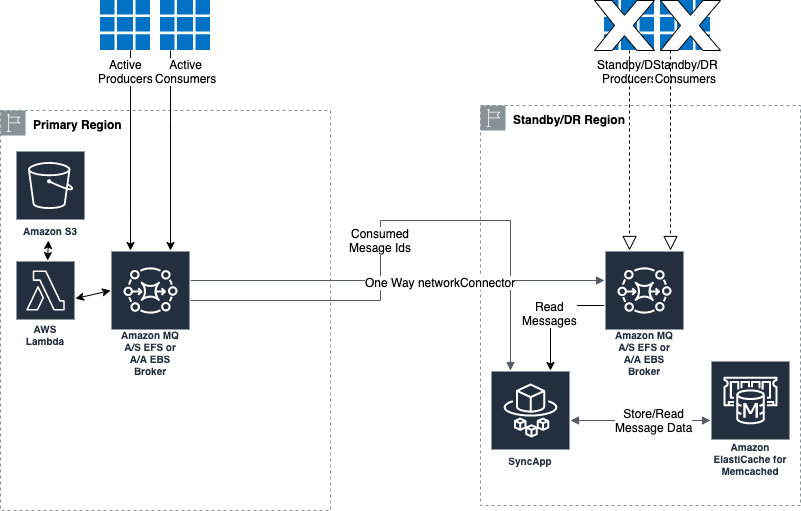
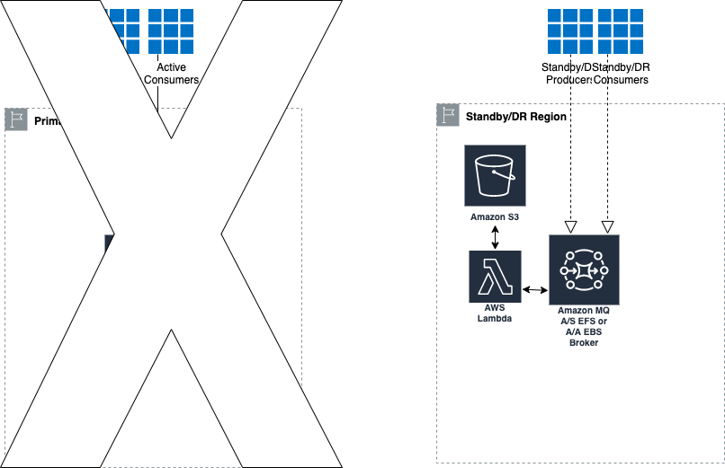
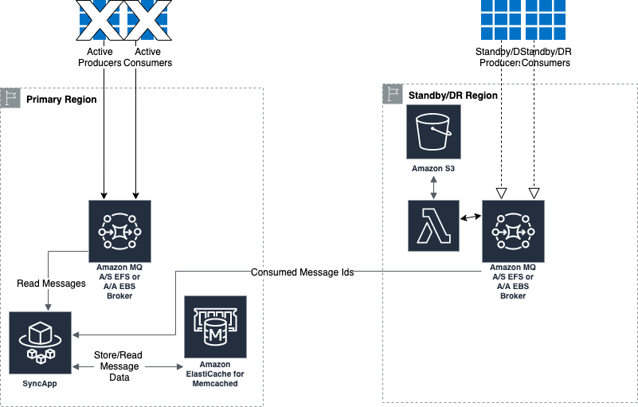
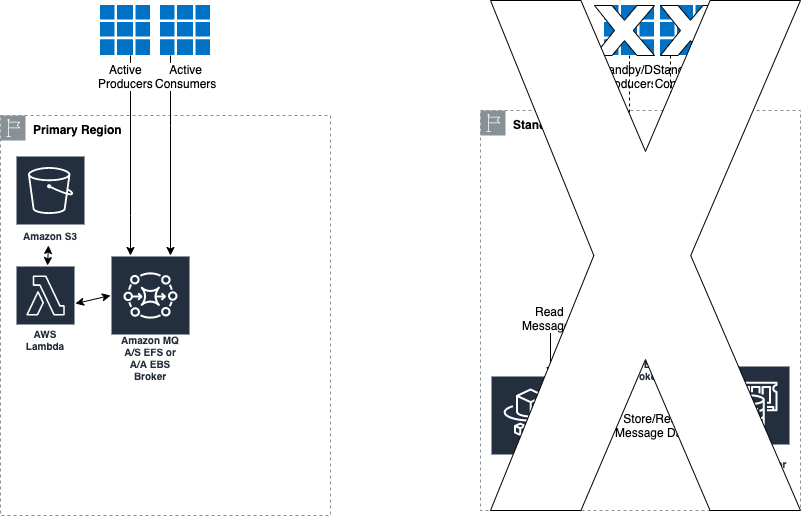

# Active/DR or Active/Active Broker Message Sync

## Customer Pain/Asks

1. Some of our customers have a DR setup for brokers in two regions as a compliance/regulatory requirement. This can be done by using Infrastructure as Code tools such as CloudFormation or Terraform. However the asks here are how does customer copy the messages to both regions and when they consume messages from one region, how does the customer ensure the messages in the DR region are in sync with active region.
2. When deploying throughput optimized brokers (EBS), AmazonMQ only supports single instance brokers. For HA, customers choose to run a redundant broker. But they are on the hook for copying messages to the redundant broker and keeping messages in sync. 

## Solution

The solution detailed below solves both of these problems with specific limitations. Problem was broken down into two distinct sub problems/tasks.

* Provide customer a way to copy messages to the DR region.
* Provide customer a sample application that keeps messages in sync** with specific RPO expectations.

### Copy messages between primary and DR brokers

Producers and Consumers in the active region send/receive messages to/from the primary queue. Messages from this queue are copied by the broker to DR region broker over a networkConnector between the active and DR brokers. A detailed example is provided in [Code Examples] section.

 * Pros: Minimal changes in the application.
 * Cons: Every new queue that requires DR would need a broker configuration change on both Primary and DR brokers and rebooting both brokers. However customer can group queue changes to minimize the broker reboots or during scheduled maintenance windows.

### Sample Application to keep messages in sync between active and DR brokers

This application supports both the following scenarios:

1. One or more independent active/standby durability optimized brokers in each region with same configuration.
2. One or more independent single instance throughput optimized brokers in each region with same configuration.

Caveats:

1. Currently BrokerSync application is not tested with network of brokers/mesh in the same region. Support for syncing messages between active/DR mesh/network of brokers may be added in the future. 
2. BrokerSync application itself requires **an additional code change to populate JMSCorrelationId with ULID** (Unique Lexiographical sortable  ID) for its matching algorithm.  The rationale for ULID vs UUID is that ULID based matching helps improve the performance of the matching algorithm.

In current testing, for a durability optimized broker, each producer and each consumer have a TPS of 80 messages per sec. For throughput optimized broker, each producer and each consumer have a TPS of 500 messages per sec. In either of these cases the broker sync application must be run with at least 5-8 threads per consumer. In the event of a DR failure, RPO would be near 0 with up to 0-20 messages in the DR broker queues left over.

## Customer experience

The following step by step procedure describes how the customer experience would look like. At any time if a region fails, customer will choose two active regions and make one primary and other DR region. In case if a region fails, the customer can choose between waiting for failed region to come up or choose another region to be Primary/DR.

### Primary Region setup 

1. Setup AmazonMQ A/S Durability Optimized or A/A Throughput Optimized brokers.
2. Producer/consumer applications are configured with failover URL of the Primary Broker.
3. Setup a cron (fixed rate) scheduled Lambda to export broker configuration to an S3 bucket.

### DR Region setup

1. Setup AmazonMQ A/S Durability Optimized or A/A Throughput Optimized brokers.
2. Setup an EC2 instance in DR Region with at least 2 CPUs and 8GB RAM.
3. Setup an ElasticCache/memcached in DR Region with at least cache.r5.large.
4. In the DR region, producer/consumer applications are configured with failover URL of DR Broker.

### DR Sceanrios 

#### Active Region is Primary. Both Active and DR region are operational.

1. In Primary broker, enable advisory topics. See [Code Examples] section below for details.
2. In Primary broker, setup configuration to copy messages to DR broker. refer to [To Copy Messages Between Primary And DR Brokers]. 
3. In the DR region, the applications do not run and do not connect to the broker.  
4. When producers send messages to say TEST.QUEUE in the Primary broker, the messages get copied to TEST.QUEUE.DR and then those messages get sent to the DR broker and finally gets copied to TEST.QUEUE on the DR broker. 
5. In the DR region, the BrokerSync application subscribes to the Consumed Messages and Active Consumers topics. When a message is consumed on the Primary broker, its messageId is stored in Cache and tries to read a message from DR broker queue, checks to see if the Cache contains the messageId, if exists, deletes the message from the queue. 



#### Active region failed.  Failover to DR region.

1. The BrokerSync application will stop as soon as it notices that active region broker is no longer available.
2. The ElasticCache/memcached cluster is no longer needed. Customer can delete the CloudFormation stack that removes these resources from DR region.
3. Customer will use AWS CLI command to save a copy of the current DR region configuration.
4. Customer will use AWS CLI command to replace DR broker configuration with Primary broker configuration (saved by a Lambda in S3. Refer to SETUP PRIMARY REGION step 3)
5. Customer will setup Lambda to export DR broker configuration in S3. 
6. Customer will reboot the DR broker to get it operational. This broker will become the new Primary Broker.
7. Customer will start producers and consumers in the DR region. 
8. Producers and Consumers will continue their normal processing. Since the active region is not available, messages will be queued in the DR region’s DR queues. 
9. Customer can choose to wait for failed region to come up or setup a different region as DR region. If customer chooses later, follow steps in SETUP DR REGION, and in addition, customer would need to add networkConnector from the current active region and the DR region and this requires a broker restart in both regions.



#### Active region is available and will be the new DR region. Current region will continue to be active. 

1. Active region is back in operation.
2. Customer will use AWS CLI to copy the previous DR broker configuration to the Active region (saved in step 5 in the previous section) and will bring the broker up.
3. Customer would need to start the BrokerSync application by switching the active/DR brokers in SSM parameters.
4. Once the active/DR regions brokers establish network connectivity, messages from queues in current active region will automatically copied to current DR region. 
5. BrokerSync application now starts keeping messages in sync. 



#### DR Region Failed 

1. DR region failed. Primary region is active. 
2. Producers and Consumers continue the operation. However the DR queues in Primary broker keep saving messages.
3. Follow steps in SETUP DR REGION to bring up the DR region, and in addition, customer would need to add networkConnector from the current active region and the new DR region and this requires a broker restart in both regions. 



## Code Examples

### BrokerSync application

https://github.com/sam-andaluri/BrokerSync

### Copying Primary Broker configuration to DR broker

#### Enabling advisory messages

```
 <policyEntry advisoryForConsumed="true" queue="&gt;" sendAdvisoryIfNoConsumers="true"/>
```

In the active region producer, when sending a message to a destination, use the example code below to set CorrelationId. This is mandatory in order for the BrokerSync application to sync messages between Primary and DR broker.

```
import io.azam.ulidj.ULID;
Message message = session.createTextMessage(strMessage);
message.setJMSCorrelationID(ULID.random());
```

#### Background copy of messages via broker 

On the active region broker, for each physical queue, add a queue with .DR extension to differentiate the DR queue with active queue. This naming convention can be changed by the customer. But the DR and Active queues must have unique names and should be easily distinguishable.

```
  <destinations>
    <queue physicalName="TEST.QUEUE"/>
    <queue physicalName="TEST.QUEUE.DR"/>
  </destinations>
```

On the active region broker, configure destinationInterceptors as shown below. This copies and forwards the messages sent to TEST.QUEUE to TEST.QUEUE.DR. 

```
<destinationInterceptors>
    <virtualDestinationInterceptor>
      <virtualDestinations>
        <compositeQueue forwardOnly="false" name="TEST.QUEUE">
          <forwardTo>
            <queue physicalName="TEST.QUEUE.DR"/>
          </forwardTo>
        </compositeQueue>
      </virtualDestinations>
    </virtualDestinationInterceptor>
  </destinationInterceptors>
```

On the active region broker, setup a networkConnector between active and DR brokers as shown below. This configuration allows the messages to flow out from TEST.QUEUE.DR but prevents messages from flowing in the opposite direction.

```
 <networkConnectors>
    <networkConnector name="to-pdx-broker" uri="masterslave:(ssl://b-a89ccbfc-2c24-45ec-a8c0-1839aa5a94f1-1.mq.us-west-2.amazonaws.com:61617,ssl://b-a89ccbfc-2c24-45ec-a8c0-1839aa5a94f1-2.mq.us-west-2.amazonaws.com:61617)" userName="aws">
      <staticallyIncludedDestinations>
        <queue physicalName="TEST.QUEUE.DR"/>
      </staticallyIncludedDestinations>
      <excludedDestinations>
        <queue physicalName="TEST.QUEUE"/>
      </excludedDestinations>
    </networkConnector>
  </networkConnectors>
```

On the DR region broker, set destinationInterceptors as shown below. This configuration copies messages from TEST.QUEUE.DR to TEST.QUEUE. The messages in this queue are the same messages sent to TEST.QUEUE in the active region.

```
  <destinationInterceptors>
    <virtualDestinationInterceptor>
      <virtualDestinations>
        <compositeQueue forwardOnly="true" name="TEST.QUEUE.DR">
          <forwardTo>
            <queue physicalName="TEST.QUEUE"/>
          </forwardTo>
        </compositeQueue>
      </virtualDestinations>
    </virtualDestinationInterceptor>
  </destinationInterceptors>
```

On the DR region broker, setup a networkConnector between DR and active brokers as shown below.

```
  <networkConnectors>
    <networkConnector name="to-iad" uri="masterslave:(ssl://b-590425c9-1a73-43b0-ac7b-03bb58ecd8c1-1.mq.us-east-1.amazonaws.com:61617,ssl://b-590425c9-1a73-43b0-ac7b-03bb58ecd8c1-2.mq.us-east-1.amazonaws.com:61617)" userName="aws">
      <excludedDestinations>
        <queue physicalName="TEST.QUEUE"/>
      </excludedDestinations>
    </networkConnector>
  </networkConnectors>
```
